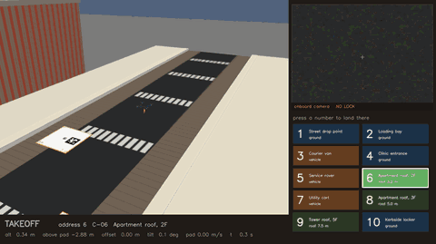
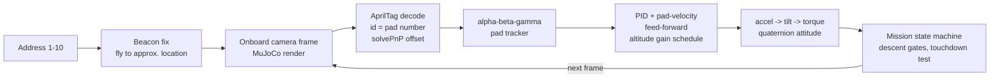
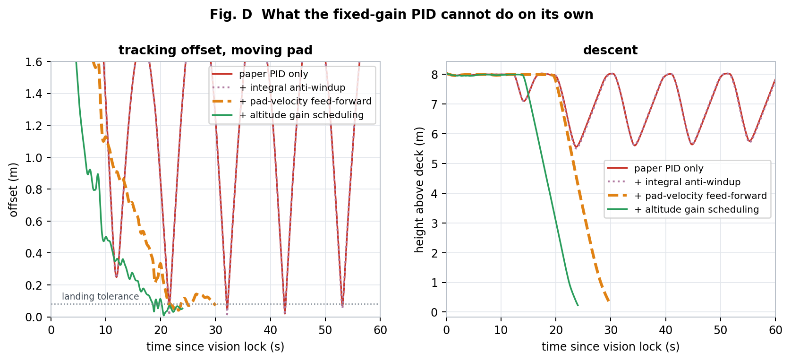

# Vision-Guided Drone Landing on Moving, Addressed Pads


A MuJoCo quadrotor that flies to a numbered address, finds the right landing pad
with its own downward camera, tracks it while it moves, and lands on it. Ten pads:
on the street, on three moving vehicles, and on apartment roofs.

Nothing in the perception path is faked: frames are rendered from the drone's
camera, real `tag36h11` AprilTags are decoded with `pupil_apriltags`, and pose
comes from `cv2.solvePnP` — so when the drone tilts, the tag really does swing
across the image.

> **Course project** — Drones (Semester 5), Amrita Vishwa Vidyapeetham, Coimbatore.
> Base paper: Zhou Li et al., *UAV Autonomous Landing Technology Based on AprilTags
> Vision Positioning Algorithm*, 38th Chinese Control Conference, 2019.
> This simulation builds on our team's original MuJoCo project
> ([Gayathri-Vaishnav/Drones_S5_CD_4_Apriltags_quaternion_Landing-](https://github.com/Gayathri-Vaishnav/Drones_S5_CD_4_Apriltags_quaternion_Landing-))
> and extends it with the addressing layer, moving/roof pads, the guidance changes and the evaluation below.



## How it works



Each pad carries two tags — a large one (id = pad number) for the approach and a
small one (id + 10) for the last two metres — so the drone ignores the other pads
that are often in frame at the same time.

## Results

From `results/mujoco_summary.json` (every frame rendered and decoded):

| Experiment | Result |
|---|---|
| Monte Carlo, 40 missions across all 10 addresses | **40/40 landed**, mean error 2.9 cm (static 1.2 cm, moving 6.8 cm), p95 10.6 cm |
| Mid-flight / post-landing diverts, 20 missions | 20/20 landed, 0 go-arounds |
| Tag-based pad offset estimate, 90 samples | 86.7 % frames decoded, mean error 6.9 cm |
| Frames with more than one pad visible | 46.7 % — the tag-id filter always kept the right one |

The ablation is the useful part. On a moving pad (6 seeds each):

| Controller | Landed |
|---|---:|
| Base paper's fixed-gain PID | 0 / 6 |
| + integral anti-windup | 0 / 6 |
| + pad-velocity feed-forward | 4 / 6 |
| + altitude gain scheduling | **6 / 6** |

The paper's PID alone can't close the lag behind a moving pad; feed-forward on the
tracked pad velocity is what makes it land.



Limitations: it's a simulation — no sensor latency model beyond the camera rate,
idealised motor dynamics, and the "AirTag" beacon fix is modelled, not a real radio.

## Run it

On Windows just double-click **`run.bat`**. It checks the environment, installs
anything missing the first time, then opens the simulation straight away — no
prompts.

One window: the world on the left, the drone's own camera top right, and the ten
landing sites as numbered buttons underneath it. **Press a number key, or click a
button, and the drone flies there and lands** — including mid-flight, which makes
it a divert rather than a restart.

```bash
run.bat
```

```bash
run.bat 5
```


Other things `run.bat` can do:

| command | what it does |
|---------|--------------|
| `run.bat check` | verify the environment and prove the detector decodes a marker |
| `run.bat analyse` | controllability, observability and the lerp/slerp analysis |
| `run.bat paper 5` | fly address 5 with the base paper's fixed-gain PID alone |
| `run.bat record 3` | record a mission to an animated GIF |
| `run.bat evaluate` | run every experiment and rebuild all figures |
| `run.bat world` | regenerate the pad textures and the MuJoCo world |
| `run.bat install` | install the Python packages |

Everything below is the same thing without the batch file.

Live demo — asks which address to fly to, opens the 3D viewer and the onboard
camera window:

```bash
python drone_sim/demo.py
```

Fly straight to one address, or several in sequence:

```bash
python drone_sim/demo.py 3
```

```bash
python drone_sim/demo.py 5 9 1
```

Fly with the base paper's fixed-gain PID alone, to see the moving-pad lag it
leaves behind:

```bash
python drone_sim/demo.py 5 --paper
```

Regenerate the world and the pad textures after editing `config.py`:

```bash
python drone_sim/world/build_world.py
```

Run every experiment and rebuild all figures (this takes about half an hour —
every frame is really rendered and really decoded):

```bash
python drone_sim/evaluate.py
```

Run one experiment on its own — `scene`, `addressing`, `perception`, `static`,
`dynamic`, `ablation` or `mc`:

```bash
python drone_sim/evaluate.py --only dynamic
```

Record a mission as a GIF, chase view beside the onboard camera:

```bash
python drone_sim/record.py 3
```

## The ten addresses

| # | Address | Kind |
|---|---------|------|
| 1 | A-01 Street drop point | ground |
| 2 | A-02 Loading bay | ground |
| 3 | B-03 Courier van | **vehicle**, 0.9 m/s |
| 4 | B-04 Clinic entrance | ground |
| 5 | C-05 Service rover | **vehicle**, circling |
| 6 | C-06 Apartment roof, 2F | **roof**, 3.2 m up |
| 7 | D-07 Utility cart | **vehicle**, 0.7 m/s |
| 8 | D-08 Apartment roof, 3F | **roof**, 5.0 m up |
| 9 | E-09 Tower roof, 5F | **roof**, 7.5 m up |
| 10 | E-10 Kerbside locker | ground |

Three kinds of site: on the street, on the deck of a **moving vehicle**, and on
an **apartment roof**. A roof landing is the same manoeuvre performed higher up —
the search altitude, the descent gates and the touchdown test are all measured
relative to the surface the pad sits on, not to the ground.

Each pad carries two AprilTags: a 0.42 m marker with id = the pad number for the
approach, and a 0.12 m marker with id = pad number + 10 at the pad centre for the
last two metres. Distinct ids mean the drone can be told *which* pad to land on
and will ignore the others — at search altitude two or three pads are in frame
at once, every time.

## Layout

```
drone_sim/
  config.py            every tunable number, and the address book, in one place
  world/build_world.py generates the pad textures and the MuJoCo world from config
  physics/quad.py      MuJoCo env: body-frame thrust, wind, moving pads, sensors
  control/attitude.py  acceleration -> tilt -> torque (a real quadrotor must tilt)
  control/guidance.py  PID of eq.(9), alpha-beta-gamma pad tracker, gain schedule
  perception/vision.py real camera frames -> AprilTag decode -> pad-centre offset
  perception/beacon.py the AirTag radio fix that makes an address flyable
  mission.py           the state machine and the landing interlocks
  panel.py             the interactive control panel (this is what run.bat opens)
  demo.py              the older two-window demo, kept for reference
  control/quaternion.py quaternion algebra, SLERP, and the orientation filter
  analysis.py          controllability, observability, lerp/slerp analysis
  selftest.py          health check: imports, world, camera, detector
  record.py            records a mission to an animated GIF
  evaluate.py          all experiments -> figures/ and results/
  make_diagrams.py     the explanatory diagrams used in the methodology document
run.bat                one-click launcher for all of the above (Windows)
figures/               every figure the experiments produce
matlab/                MATLAB re-implementation of the landing loop + ablation batch
netlogo/               NetLogo agent model of the same mission
assets/                README media
results/               mujoco_summary.json, the numbers the document quotes
simulation/            an earlier kinematic prototype (matplotlib, no physics)
```

## Requirements

Python 3.11+, `mujoco`, `pupil-apriltags`, `opencv-python`, `numpy`,
`matplotlib` — `pip install -r requirements.txt`.
On a headless Linux box set `MUJOCO_GL=osmesa` (needs `libosmesa6`).
